# Home SOC Lab — Security Monitoring & Threat Detection

A home Security Operations Center (SOC) lab built in Splunk to practice end-to-end SOC analyst workflows: log source configuration, attack simulation, detection engineering, alerting, dashboarding, and incident investigation — mapped to the MITRE ATT&CK framework.

## Overview

This project simulates three realistic attack techniques on a Windows 11 endpoint, develops Splunk detection logic (SPL) for each, converts the detections into scheduled alerts, consolidates them into a monitoring dashboard, and reconstructs the full attack sequence as an incident investigation timeline.

## Tools & Environment

| Component | Description |
|---|---|
| Host | macOS with VMware Fusion |
| Monitored Endpoint | Windows 11 (64-bit ARM) virtual machine |
| SIEM Platform | Splunk Enterprise (Free Trial), version 10.4.0 |
| Log Sources | Windows Event Logs — Security, System, Application |
| Auditing Configuration | Windows Security Auditing enabled for Process Creation (Event ID 4688) and Filtering Platform Connection (Event ID 5158); PowerShell Script Block Logging enabled |
| Attack Simulation | PowerShell — brute-force authentication loop, reconnaissance command execution, and TCP port scan loop against the local host |

## Attack Scenarios & Detections

### 1. Brute Force Authentication Attempts (Event ID 4625)

Repeated failed logon attempts were simulated against a non-existent account ("FakeUser") using `net use` with intentionally incorrect credentials — mimicking a password-guessing / brute-force attack.

```
index=* sourcetype="WinEventLog:Security" EventCode=4625
```

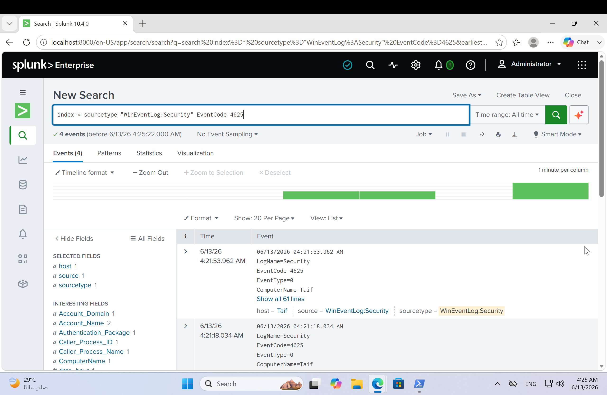

**Detection query** — flags any account with more than 3 failed logons:

```
index=* sourcetype="WinEventLog:Security" EventCode=4625
| stats count by Account_Name | where count > 3
```

Result: 4 failed logon events were recorded against the FakeUser account, exceeding the threshold of 3 and triggering **Alert 1 — "Brute Force Attack - Failed Logins."**

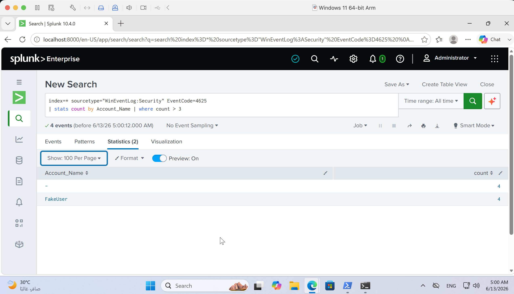

### 2. Suspicious PowerShell Execution (Event ID 4688)

PowerShell was executed with the execution policy bypassed (`-ExecutionPolicy Bypass`) to run host reconnaissance commands (`whoami`, `hostname`, `ipconfig`) — a pattern commonly associated with post-exploitation activity.

```
index=* sourcetype="WinEventLog:Security" EventCode=4688
```

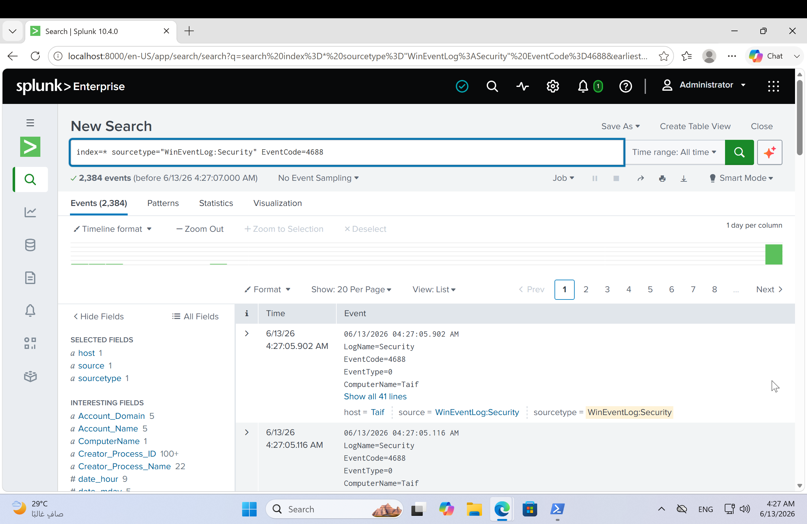

Narrowed to PowerShell-specific process creations:

```
index=* sourcetype="WinEventLog:Security" EventCode=4688 New_Process_Name="*powershell*"
```

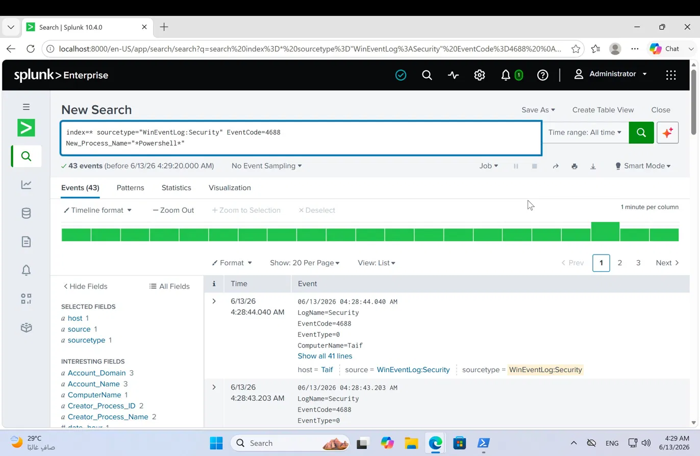

**Detection query** — groups PowerShell executions by account:

```
index=* sourcetype="WinEventLog:Security" EventCode=4688 New_Process_Name="*powershell*"
| stats count by Account_Name | where count > 0
```

Result: of 120 grouped events, 2 PowerShell executions were attributed to the interactive user account (`taifs`), with the remainder attributed to the Splunk service account (`Splunkd`). This confirms **Alert 2 — "Suspicious PowerShell Execution"** correctly isolates the user-initiated activity.

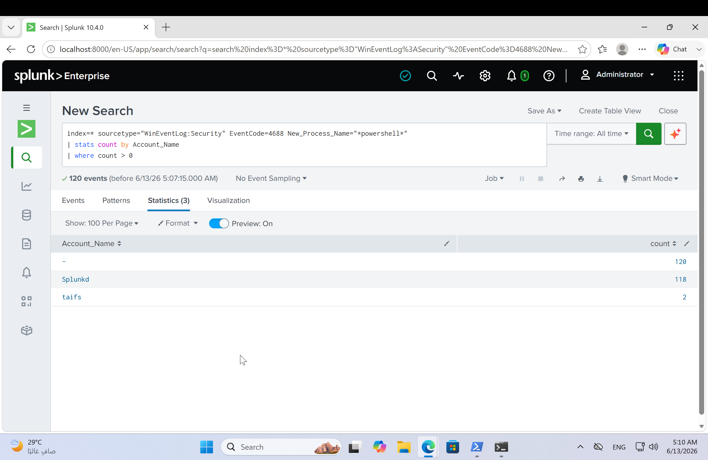

### 3. Port Scan / Service Discovery (Event ID 5158)

A PowerShell loop attempted TCP connections to ports 1–1024 on the local host — simulating a port scan used for service discovery and lateral movement planning.

```
index=* sourcetype="WinEventLog:Security" EventCode=5158
```

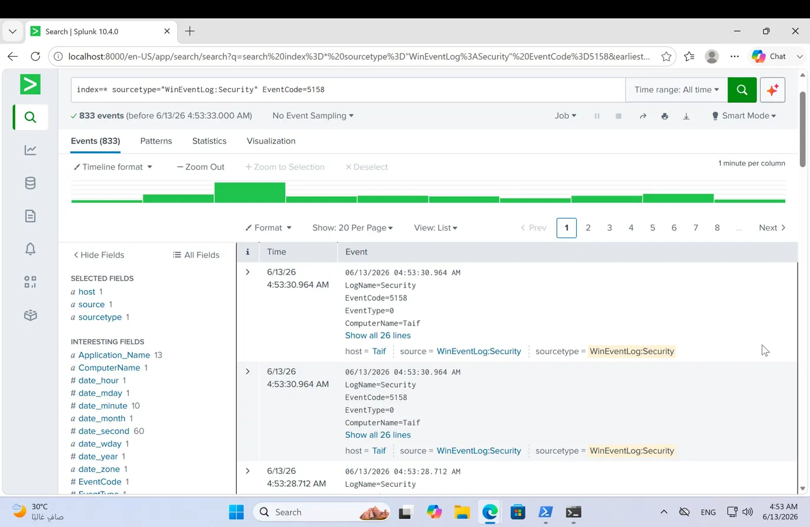

**Detection query** — identifies connection-binding activity from shell processes:

```
index=* sourcetype="WinEventLog:Security" EventCode=5158
Application_Name="*powershell*" OR Application_Name="*cmd*"
| stats count by Application_Name
```

Result: 58 connection-binding events were attributed to `powershell.exe` within a one-hour window, triggering **Alert 3 — "Suspicious Port Scan - PowerShell."**

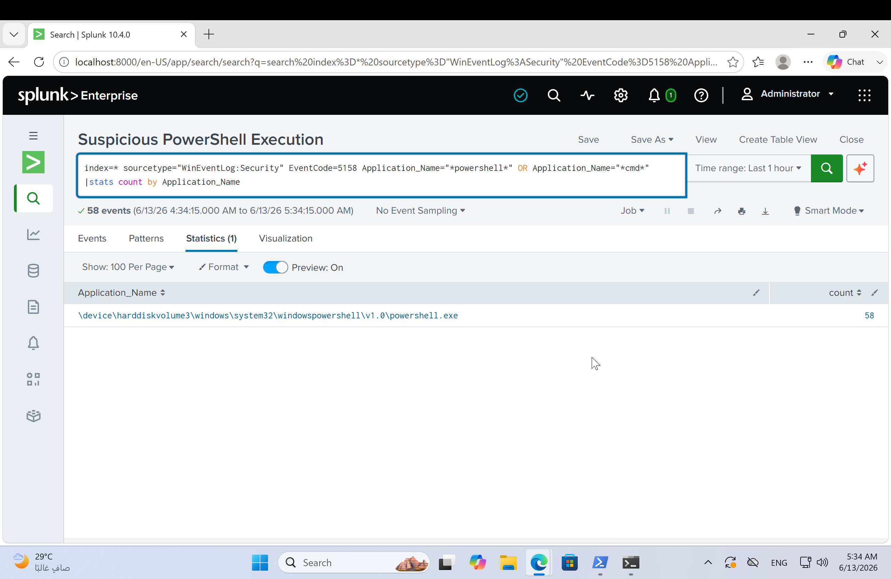

## Alert Configuration

| Alert | Trigger Condition | Schedule | Severity | Status |
|---|---|---|---|---|
| Brute Force Attack - Failed Logins | Failed logons (4625) per account > 3 | Hourly, at 15 min past hour | High | Enabled |
| Suspicious PowerShell Execution | PowerShell process creations (4688) > 0 | Hourly | Medium | Enabled |
| Suspicious Port Scan - PowerShell | Connection binds (5158) from powershell/cmd > 0 | Hourly | High | Enabled |

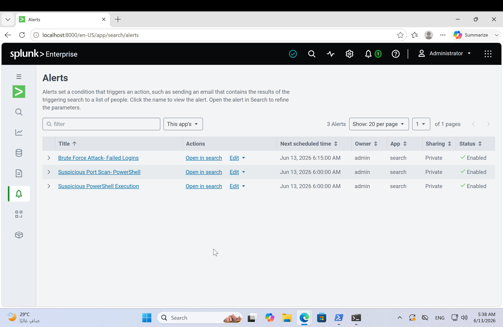

## SOC Monitoring Dashboard

A Classic Dashboard ("SOC Monitoring Dashboard") consolidates all three detections into a single-pane view. Each panel is driven directly by the same SPL query used in its corresponding alert.

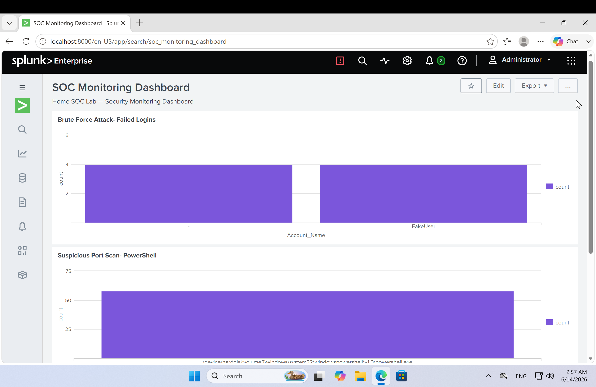
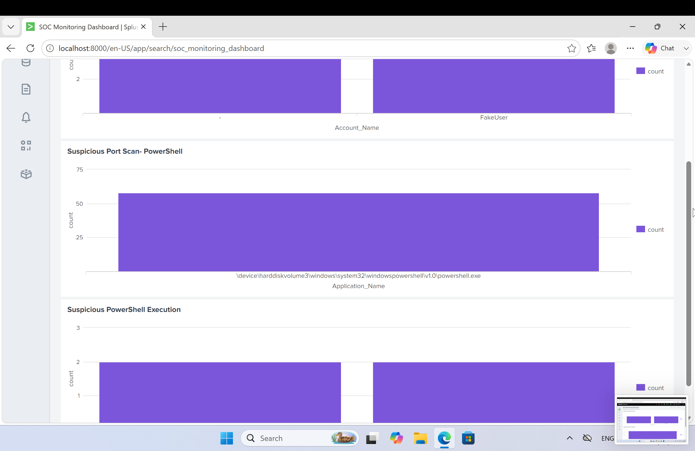
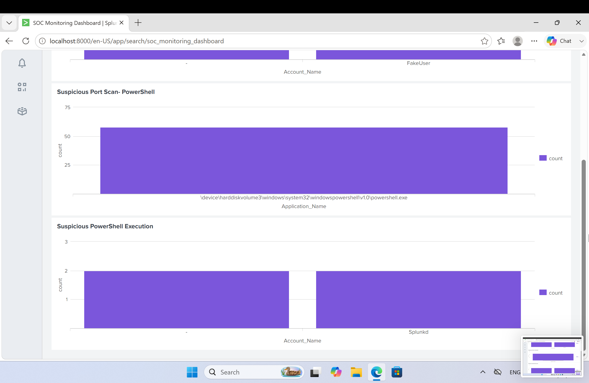

## Incident Investigation & Timeline

By correlating the timestamps of the three detections, a chronological attack timeline was reconstructed:

| Time (UTC) | Event Code | Source | Description |
|---|---|---|---|
| 04:18:43 | 4625 | FakeUser | Failed logon attempt #1 (brute force) |
| 04:19:19 | 4625 | FakeUser | Failed logon attempt #2 |
| 04:21:18 | 4625 | FakeUser | Failed logon attempt #3 |
| 04:21:53 | 4625 | FakeUser | Failed logon attempt #4 — Alert 1 triggers (> 3 failures) |
| 04:26:23 | 4688 | taifs | PowerShell launched with -ExecutionPolicy Bypass; reconnaissance commands executed (whoami, hostname, ipconfig) |
| 04:32:11 | 4688 | taifs | Second PowerShell execution — Alert 2 triggers |
| 04:44:46 – 04:47:44+ | 5158 | powershell.exe | Sequential port-binding activity (~58 ports) consistent with port scan reconnaissance — Alert 3 triggers |

**Investigation Narrative**

Analysis of the collected logs revealed a sequence of events consistent with a potential attack progression. The activity began with multiple failed authentication attempts targeting the account FakeUser, resulting in four failed logon events within a three-minute period — a pattern that may indicate a brute-force or password-guessing attempt.

Shortly afterward, activity was observed under the account `taifs`, where PowerShell was executed with the execution policy bypassed. Commands such as `whoami`, `hostname`, and `ipconfig` were executed, commonly associated with host reconnaissance and post-compromise enumeration.

Approximately 12–18 minutes later, a significant increase in network-related events was detected. The host initiated port-binding activity across numerous ports, generating hundreds of network events — consistent with service discovery or network reconnaissance techniques used by attackers to identify accessible services and plan lateral movement.

By correlating authentication, process creation, and network activity logs, the investigation demonstrated how multiple security events can be linked to form a coherent attack timeline, aligning with several MITRE ATT&CK tactics: Credential Access, Discovery, and Execution.

## MITRE ATT&CK Mapping

| Detection Scenario | MITRE ATT&CK Tactic | Technique (ID) |
|---|---|---|
| Brute Force Authentication (Event ID 4625) | Credential Access | Brute Force (T1110) |
| Suspicious PowerShell Execution (Event ID 4688) | Execution / Discovery | Command and Scripting Interpreter: PowerShell (T1059.001); System Information / Network Configuration Discovery (T1082 / T1016) |
| Port Scan / Service Discovery (Event ID 5158) | Discovery | Network Service Discovery (T1046) |

## Recommendations for Future Work

- Integrate Sysmon for richer process, network, and registry telemetry beyond native Windows auditing.
- Expand detection coverage to include lateral movement (e.g., PsExec, WMI) and credential dumping (e.g., LSASS access) scenarios.
- Add a fourth dashboard panel visualizing the end-to-end event timeline to support faster triage.
- Implement automated response actions (e.g., account lockout notification) for high-severity alerts.
- Extend log correlation to Elastic Stack (ELK) to practice cross-platform SIEM analysis.

## Full Report

The complete write-up, including all evidence and analysis, is available here: [Home_SOC_Lab_Report.pdf](Home_SOC_Lab_Report.pdf)
